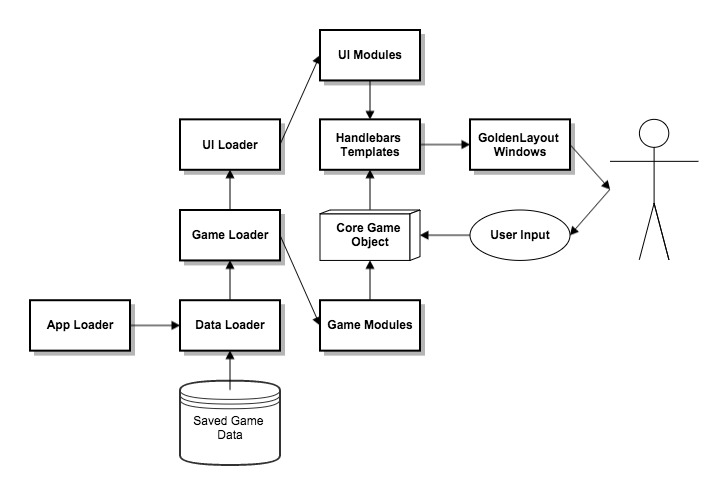

# Code Structure

With DCG I wanted to create something others will want to contribute to, fork, and use. To do this I've tried to design a system with:

* clean code structure
* understandable syntax
* simple and easy languages

## Modular Design Pattern

The [ modular design pattern ]( https://en.wikipedia.org/wiki/Module_pattern#Concept ) offers many benefits to a project like this. Separating the program into logical functional components that interact with each other will (I hope) give us these benefits:

+ **Conceptual simplicity** - It will offer easier debugging, testing, and continuous integration.
+ **Extensibility** - It will make it easier to add additional modules in the future.
+ **Configurability** - It will enable individual developers to remove, disable, or hide different modules to create a different game experiences.
+ **Scalability** - It will allow the game to grow in size and complexity, while (hopefully) remaining managable.
+ **Portability** - The various modules in DCG will be very dependant, so this isn't a huge concern. However, if a module is simple and usefull enough, it could easily be used in other projects.

Using this approach, I've created this architecture:

#### Webpack and ES6

Webpack has a Babel.js loader, so we can write ES6 code, and Babel.js takes care of the rest. This is great, because it means we can write gorgeous Javascript.

Webpack will load all of the modules (using the ES6 `import` or webpack's `require()` interchangably). However, when you're importing a non-JS object (eg. importing css, or json files) you should use webpack's `require()` method ([ example ]( ../src/game_modules/dcg-world-data/world-data.js )). This will clarify that you're importing a simple file, not importing a JS module.

#### Modular Code Structure

The goal of a modular structure is to create small, conceptually simple packages. Each module should be as independent as possible. This makes testing and debugging simpler, and more focussed.

###### Separation of Concerns

For DCG, we're separating the modules we write into two categories. Game modules, and UI modules.

Game Modules add functionality to the game. Timers, Combat, Party actions, Maps, NPCs are all examples of code that runs the game. This code can be executed, tested and debugged without ever displaying anything to the user.

UI modules simply display the data from the Game Modules to the user.

#### Tests
## Storage of running game state
## Storage of saved game state
